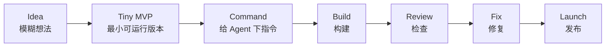

# FirstMVPSkill

> 不知道用什么工具？不知道选什么模式？不知道从哪开始？
> 别纠结了。用智能体做出你的第一个 AI MVP。
>
> Can't choose a tool? Can't pick a mode? Don't know where to start?
> Stop overthinking. Ship your first AI MVP with agents.

<p align="center">
  
</p>

<p align="center">
  <a href="LICENSE"></a>
  
  
  
</p>

第一次使用？先看：[Start Here / 从这里开始](START_HERE.md)

普通人也能用 AI Agent，把想法做成第一个可运行的小作品、小工具或 AI MVP。
不知道用什么工具？不知道选什么模式？这个 skill 帮你做选择。

FirstMVPSkill helps ordinary people, beginners, students, creators, and agent users turn ideas into their first working project, tool, or AI MVP with AI agents. Can't choose a tool or mode? This skill decides for you.

FirstMVPSkill 会根据你每天可投入的时间调整计划。Agent 负责快速生成方案和执行，用户负责选择、验收和加入自己的想法。

Plans adapt to your daily time budget. Agents move fast; users decide, review, and shape the product.

欢迎 star、issue、PR，尤其欢迎贡献中文 AI MVP 新手案例。

## Download / 下载

### 方式 1：不懂 Git，直接下载 ZIP

1. 点击 GitHub 页面右上角绿色按钮 **Code**
2. 点击 **Download ZIP**
3. 解压文件
4. 打开 `START_HERE.md`
5. 复制 starter prompt 到你正在使用的 AI 工具里

### 方式 2：会 Git

```bash
git clone https://github.com/mikazuhe13-ui/first-mvp-skill.git
cd first-mvp-skill
```

### 方式 3：会 npm / Node.js

如果你已经安装 Node.js 和 npm，可以在项目目录里运行：

```bash
npm install -g .
first-mvp-skill install
```

npm 不是必须的。FirstMVPSkill 本质上是 Agent Skill Pack，不是必须通过 npm 安装的软件包。

### 如果你的 Agent 支持 skill folder

复制完整文件夹，不要只复制 SKILL.md：

```text
skills/first-mvp-launch/
skills/agent-command-coach/
```

### 如果你的工具不支持 skills 或 slash commands

直接把 `START_HERE.md` 或 `commands/*.md` 当作普通 prompt 使用。

## How it works / 工作流

FirstMVPSkill 把一个模糊想法压缩成可执行、可检查、可发布的小项目闭环。

FirstMVPSkill turns a vague idea into a small executable, reviewable, and shippable loop.



## Choose your path / 选择入口

| You are... / 你的情况 | Start here / 从这里开始 |
|---|---|
| Not sure where to start / 不确定从哪开始 | [START_HERE.md](START_HERE.md) |
| Can't choose which tool to use / 不知道用什么工具 | [playbooks/agent-tool-playbook.md](playbooks/agent-tool-playbook.md) |
| Can't choose which mode / 不知道选什么模式 | [playbooks/agent-mode-matrix.md](playbooks/agent-mode-matrix.md) |
| Student or creator / 学生或创作者 | [examples/closed-loop-ai-study-assistant.md](examples/closed-loop-ai-study-assistant.md) |
| Want to see a live demo / 想看真实 demo | [examples/real-build-ai-action-plan-generator.md](examples/real-build-ai-action-plan-generator.md) |
| Have an idea but no plan / 有想法但没计划 | [skills/first-mvp-launch/SKILL.md](skills/first-mvp-launch/SKILL.md) |
| Want to choose the right command / 不知道用哪条指令 | [commands/README.md](commands/README.md) |
| Need agent commands / 需要写 Agent 指令 | [commands/planning-command.md](commands/planning-command.md) |
| Want to become better at using agents / 想逐步成为 Agent 熟练用户 | [docs/agent-skill-ladder.md](docs/agent-skill-ladder.md) |
| Agent power user choosing tools/modes / 熟练用户选择工具或模式 | [playbooks/agent-mode-matrix.md](playbooks/agent-mode-matrix.md) |
| Current agent lacks features / 当前工具能力不够 | [playbooks/current-agent-adapter.md](playbooks/current-agent-adapter.md) |
| Want token-efficient routing / 想减少 token 消耗 | [routing/skill-router.md](routing/skill-router.md) |

## What this is / 这是什么

以前只有程序员能把想法做成产品。现在普通人、学生、创作者、AI 新手和 vibe coder 也可以用 AI Agent，把想法做成自己的小作品、小工具或 AI MVP。

**你不需要先成为专家。你只需要一个想法。**

FirstMVPSkill 不是通用 Prompt 集合。它是一个帮你做选择的 AI MVP 启动系统。

FirstMVPSkill is not a generic prompt collection. It is a decision-making AI MVP launch system.

**它帮你解决这些问题：**

- 不知道用什么工具？→ 帮你选最小工具栈
- 不知道选什么模式？→ 帮你选 mode、reasoning level、review gate
- 不知道从哪开始？→ 帮你压缩成 Day 1 指令
- 功能太多做不完？→ 帮你砍到 1-3 个核心功能
- 做到一半卡住了？→ 帮你重置闭环继续推进

**Who is this for / 适合谁：**

- 有想法但不知道怎么开始的普通人
- 想用 AI 做点什么但不知道选什么工具的人
- 已有工具但不知道该用什么模式的人
- 学生、创作者、vibe coder、indie hacker
- 任何想把想法变成可运行小作品的人

## 30 秒 Demo / 30-second demo

输入一个想法：

```text
I want to build an AI study assistant that helps students review notes.
```

FirstMVPSkill 会把它压缩成：

```text
Tiny MVP:
1. Upload notes
2. Generate practice questions
3. Take quiz and see score

Not in V1:
- Login
- Payment
- Mobile app
- Flashcards

Day 1 command:
Create a basic Streamlit app with a title, note uploader, and text preview.
Do not add AI yet.

Acceptance Gate:
The app runs locally and displays uploaded text.

Next action:
Paste the Day 1 command into your current AI agent.
```

这就是最小可用路径：一个想法，一个下一步动作，一个能运行的小结果。

That is the smallest useful path: one idea, one next action, one working result.

**真实可运行示例 / Real working demo:**
[AI Action Plan Generator](demo/ai-action-plan-generator/) — 一个中英双语 demo，展示 FirstMVPSkill 如何把模糊想法变成 Tiny MVP、Not in V1、7-Day Plan、Day 1 Agent Command、Acceptance Gate 和 Next Action。

## Quick start / 快速开始

1. 克隆或下载这个仓库。  
   Clone or download this repository.

   ```bash
   git clone https://github.com/mikazuhe13-ui/first-mvp-skill.git
   cd first-mvp-skill
   ```

2. 如果你的 Agent 支持 skills，复制完整 skill folder，不要只复制 `SKILL.md`。  
   If your agent supports skills, copy the full skill folder.

   ```text
   skills/first-mvp-launch/
   skills/agent-command-coach/
   ```

3. 如果不支持 skills 或 slash commands，把 [START_HERE.md](START_HERE.md) 里的 starter prompt 当普通 prompt 使用。  
   If skills or slash commands are not supported, use the starter prompt in [START_HERE.md](START_HERE.md).

完整安装说明见 [docs/installation.md](docs/installation.md)，完整快速开始见 [docs/quick-start.md](docs/quick-start.md)。

## What's included / 包含什么

| Folder | Purpose |
|---|---|
| `skills/` | Core skills: launch a Tiny MVP and coach Agent commands |
| `commands/` | Copy-paste Agent Command Pack for planning, coding, review, fix, and feedback |
| `templates/` | Project Context Pack, status, MVP plan, and task brief templates |
| `checklists/` | Acceptance Gate, launch readiness, scope, and command checks |
| `examples/` | Real beginner-friendly AI MVP examples + live demo case study |
| `playbooks/` | Advanced decisions: Agent Mode Matrix, subagents, long tasks, fallback workflows |
| `routing/` | Skill routing and token-efficient Compact / Standard / Full Mode rules |
| `demo/` | Live demo: AI Action Plan Generator (HTML, zero dependencies) |
| `docs/` | Full installation, guide, troubleshooting, FAQ, and contribution docs |

详细文件说明见 [docs/guide.md](docs/guide.md) 和 [docs/api-reference.md](docs/api-reference.md)。

## Docs / 文档

| Need | Read |
|---|---|
| Usage Guide / 使用指南 | [docs/usage-guide.md](docs/usage-guide.md) |
| Installation / 安装 | [docs/installation.md](docs/installation.md) |
| Quick Start / 快速开始 | [docs/quick-start.md](docs/quick-start.md) |
| Complete Guide / 完整指南 | [docs/guide.md](docs/guide.md) |
| Troubleshooting / 报错处理 | [docs/troubleshooting.md](docs/troubleshooting.md) |
| FAQ / 常见问题 | [docs/faq.md](docs/faq.md) |
| Token modes / Token 模式 | [routing/token-budget-policy.md](routing/token-budget-policy.md) |
| Agent Compatibility / 智能体兼容性 | [docs/agent-compatibility.md](docs/agent-compatibility.md) |
| Contributing / 参与贡献 | [docs/contributing.md](docs/contributing.md) |

## How this differs / 和类似项目有什么不同

| 其他项目类型 / Other type | 通常给什么 / Usually gives | FirstMVPSkill 给什么 / Gives |
|---|---|---|
| Prompt 集合 / Prompt collections | 很多 prompt 可以复制 | 一个完整 launch loop + commands + gates |
| MVP 规划器 / MVP planners | 一个计划或路线图 | Tiny MVP + 7 天执行 + Project Context Pack |
| Agent 教程 / Agent tutorials | 特定工具的教程 | 适配你已有工具的工作流 + 帮你选工具选模式 |
| 模板仓库 / Boilerplates | 启动代码 | 做什么、怎么指挥 Agent、怎么检查、怎么发布 |
| 工具对比文章 / Tool comparisons | 告诉你每个工具的优缺点 | 直接告诉你"你现在该用什么" |

---

## Why this exists / 为什么做这个

FirstMVPSkill 希望帮助更多人第一次真正体验到：AI 不只是聊天工具，而是可以帮助自己一步一步完成项目的执行伙伴。

你不需要一开始就精通所有工具。你不需要在 Cursor、Claude Code、Codex 之间纠结。你只需要一个想法、一个下一步动作、一个能运行的小结果，然后不断形成 Plan → Build → Review → Fix → Launch 的闭环。

Most users do not need every tool on Day 1. They do not need to compare every agent. They need one idea, one next action, one working result, and a loop they can repeat.

## Contributing / 参与贡献

欢迎提交 issue 和 PR，尤其欢迎贡献中文 AI MVP 新手案例、改进 commands、补充 checklists、优化 playbooks 或让 docs 更清楚。

请保持：简洁、可复制、中文优先、新手友好、不增加不必要复杂度。

提交 PR 前，请先阅读 [docs/contributing.md](docs/contributing.md)。提交格式见 [docs/commit-convention.md](docs/commit-convention.md)。

## License

[MIT](LICENSE)
