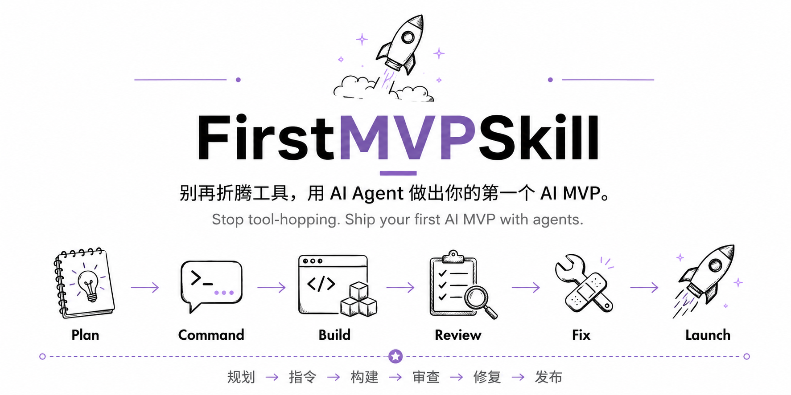
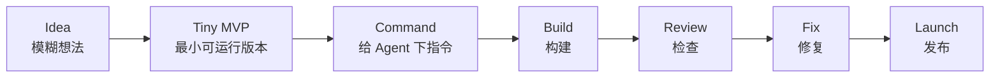

# FirstMVPSkill

> 别再折腾工具，用智能体做出你的第一个 AI MVP。  
> Stop tool-hopping. Ship your first AI MVP with agents.

<p align="center">
  
</p>

第一次使用？先看：[Start Here / 新手从这里开始](START_HERE.md)

FirstMVPSkill 新手优先，但不只服务新手。  
Easy for beginners, useful for agent power users.

欢迎 star、issue、PR，尤其欢迎贡献中文 AI MVP 新手案例。

## How it works / 工作流

FirstMVPSkill 把一个模糊想法压缩成可执行、可检查、可发布的小项目闭环。

FirstMVPSkill turns a vague idea into a small executable, reviewable, and shippable loop.



## Choose your path / 选择入口

| You are... / 你的情况 | Start here / 从这里开始 |
|---|---|
| First-time user / 第一次使用 | [START_HERE.md](START_HERE.md) |
| Have an idea but no plan / 有想法但没计划 | [skills/first-mvp-launch/SKILL.md](skills/first-mvp-launch/SKILL.md) |
| Need agent commands / 需要写 Agent 指令 | [commands/planning-command.md](commands/planning-command.md) |
| Choosing tool/mode / 不知道用哪个工具或模式 | [playbooks/agent-mode-matrix.md](playbooks/agent-mode-matrix.md) |
| Current agent lacks features / 当前工具能力不够 | [playbooks/current-agent-adapter.md](playbooks/current-agent-adapter.md) |
| Want token-efficient routing / 想减少 token 消耗 | [routing/skill-router.md](routing/skill-router.md) |

---

很多 AI 新手最后什么都没做出来，

不是因为没有想法，

而是缺少一套真正能落地的使用手册。

他们常常会：

- 一直换工具
- 一开始就想做“大而全”
- 不会给 AI Agent（智能体）下清晰指令
- 不知道什么时候检查和回顾结果（review）
- 不知道怎么形成：
  “计划 → 构建 → 检查 → 修复 → 发布”
  的闭环
- 一直停留在“准备阶段”
- 最后什么都没真正发布

Most AI beginners do not fail because they lack ideas. They fail because they switch tools, overbuild too early, give vague prompts to agents, and never ship.

FirstMVPSkill 不是通用 Prompt 集合。  
它是一个新手优先、但不只服务新手的强约束 AI MVP 启动系统。

FirstMVPSkill is not a generic prompt collection.  
It is a beginner-first, but not beginner-only, AI MVP launch system.

FirstMVPSkill 新手优先，但不只服务新手。

它也适合已经在使用 AI Agent、但不知道如何选择工具、模式、推理强度、subagent、long task 或 review gate 的用户。

FirstMVPSkill is beginner-first, but not beginner-only.

It is also useful for users who already use AI agents but need clearer decisions around tool choice, modes, reasoning effort, subagents, long tasks, and review gates.

FirstMVPSkill 的目标，不是让你继续研究工具。

而是帮助你用已有的 AI Agent，真正做出：

- 第一个可运行的 AI 项目
- 第一个可检查、可修改的工作流
- 第一个真正发布出去的 Tiny MVP（最小可运行版本）

The goal is not to make you research more tools. It is to help you use the AI agents you already have to ship one small working AI project.

## 30 秒 Demo / 30-second demo

输入一个想法：

```text
I want to build an AI study assistant that helps students review notes.
```

FirstMVPSkill 会把它压缩成：

```text
Tiny MVP:
1. Upload notes
2. Generate practice questions
3. Take quiz and see score

Not in V1:
- Login
- Payment
- Mobile app
- Flashcards

Day 1 command:
Create a basic Streamlit app with a title, note uploader, and text preview.
Do not add AI yet.

Acceptance Gate:
The app runs locally and displays uploaded text.

Next action:
Paste the Day 1 command into your current AI agent.
```

这就是最小可用路径。先做一个能运行的小结果，再继续检查、修复和发布。

That is the smallest useful path: one idea, one next action, one working result.

### 为什么不一样 / What makes this different

1. **不强迫换工具 / No forced tool switch.** 推荐合适的 agent，但优先适配你已经有的工具。
2. **不只是计划 / Not just a plan.** 输出 Tiny MVP、7-day plan、agent commands 和 Acceptance Gates。
3. **不失控 / No loss of control.** Project Context Pack 和 Acceptance Gate 让每一步可验收。
4. **不只是 prompt / Not just prompts.** 给你 commands、review steps、fix loops 和 launch checks。
5. **新手优先 / Built for beginners.** One primary agent, one task, one next action.
6. **默认省 token / Token-efficient by default.** 默认只加载相关 skill、command、checklist 或 playbook；Full Mode 只有在你要求时才分块展开。

---

## 安装 / Install

FirstMVPSkill 是 Agent Skill Pack，不是 Python package，也不是必须通过 npm 安装的软件包。

FirstMVPSkill is an Agent Skill Pack, not a Python package or required npm package.

### 推荐方式：复制 skill folder

每个 `skills/` 下的文件夹都是一个可复用 skill unit。安装时复制完整文件夹，不要只复制 `SKILL.md`。

Each folder under `skills/` is a reusable skill unit. Copy the full skill folder, not only `SKILL.md`.

```text
skills/first-mvp-launch/
skills/agent-command-coach/
```

复制到你的 Agent 支持的 skill 目录，例如：

```text
~/.codex/skills/first-mvp-launch/
~/.codex/skills/agent-command-coach/
```

如果你的工具不支持 skill folder，也可以把这些文件当作普通 prompt 使用：

- `commands/*.md`
- `templates/*.md`
- `checklists/*.md`
- `playbooks/*.md`
- `routing/*.md`

Default behavior stays constrained:

- Compact output first
- 1-3 MVP features
- 2-4 tools in the minimal practical stack
- One primary agent first
- Acceptance Gate before moving forward
- Advanced playbooks hidden until needed

详细安装说明见：

```text
docs/installation.md
```

---

## 3 分钟快速开始 / 3-minute quick start

### Minute 1: get the files

克隆或下载这个仓库。

Clone or download this repository.

```bash
git clone https://github.com/mikazuhe13-ui/first-mvp-skill.git
cd first-mvp-skill
```

### Minute 2: install or open the skill

如果你的 Agent 支持 skills，把完整 skill folder 复制到对应目录。不要只复制 `SKILL.md`。

```text
skills/first-mvp-launch/
skills/agent-command-coach/
```

If your agent supports skills, copy the full skill folder into its skill directory. Do not copy only `SKILL.md`.

如果你的工具不支持 skills，直接打开这个文件，把它当作普通 prompt 使用：

```text
skills/first-mvp-launch/SKILL.md
```

### Minute 3: paste your idea

如果工具支持 slash-style skill invocation：

```text
/first-mvp-launch I want to build an AI study assistant that helps students review for exams.
```

如果不支持 slash commands，使用：

```text
playbooks/slash-command-playbook.md
```

里的 fallback prompt。

You should get a Tiny MVP, Not in V1, a 7-day plan, a Project Context Pack, and one next action.

---

## Documentation

这些文档是普通 Markdown 文件，可以直接阅读或当作 prompt 参考。

These docs are plain Markdown files you can read or use as prompt references.

| Section | File |
|---------|------|
| Installation | [docs/installation.md](docs/installation.md) |
| Quick Start | [docs/quick-start.md](docs/quick-start.md) |
| Complete Guide | [docs/guide.md](docs/guide.md) |
| Troubleshooting | [docs/troubleshooting.md](docs/troubleshooting.md) |
| FAQ | [docs/faq.md](docs/faq.md) |
| Contributing | [docs/contributing.md](docs/contributing.md) |

---

## Before / After

### Before FirstMVPSkill

> "I want to build an AI study assistant."
>
> *Spends 3 weeks picking tools. Watches 15 tutorials. Starts 3 different projects. None of them finish.*

### After FirstMVPSkill

> "I want to build an AI study assistant."
>
> *Day 1: Defines a 3-feature MVP. Day 2-4: Builds one feature per day with agent commands. Day 5: Reviews and fixes. Day 6: Deploys. Day 7: Shares a working demo.*

---

## How this differs from similar projects

| Other project type | What it usually gives | FirstMVPSkill gives |
|--------------------|-----------------------|---------------------|
| Prompt collections | Many prompts to copy | One launch loop with commands, gates, and next actions |
| MVP planners | A plan or roadmap | Tiny MVP + 7-day execution + Project Context Pack |
| Agent tutorials | Tool-specific lessons | Tool-adaptive workflow that works with the agent you already have |
| Boilerplates | Starter code | A way to decide what to build, command agents, review, fix, and launch |
| Productivity systems | Tasks and tracking | Plan → Command → Build → Review → Fix → Launch |

FirstMVPSkill is not trying to be a framework. It is an execution system for shipping the first small version.

---

## More examples

Start with the minimal example above. When you want to see complete loops, use:

- [examples/ai-study-assistant.md](examples/ai-study-assistant.md)
- [examples/personal-knowledge-base.md](examples/personal-knowledge-base.md)
- [examples/student-competition-demo.md](examples/student-competition-demo.md)
- [examples/ai-content-tool.md](examples/ai-content-tool.md)
- [examples/closed-loop-ai-study-assistant.md](examples/closed-loop-ai-study-assistant.md)

---

## Who is this for?

- **AI beginners** — You have ideas but don't know how to start
- **Students** — You need a demo for a competition or course
- **Vibe coders** — You can prompt but can't ship
- **Indie hackers** — You want to launch fast without overbuilding
- **Tutorial watchers** — You've been learning but not shipping

---

## Core loop

```
Plan → Command → Build → Review → Fix → Launch
```

| Phase | What you do | Tool |
|-------|-------------|------|
| Plan | Define your Tiny MVP | `/first-mvp-launch` |
| Command | Write agent instructions | `commands/*.md` |
| Build | Execute with AI agents | `coding-agent-command` |
| Review | Check what was built | `codex-review-command` |
| Fix | Fix issues, prevent bloat | `anti-overbuilding-command` |
| Launch | Ship it | `launch-readiness-checklist` |

Every loop produces five things:

1. Current goal
2. Executable task
3. Acceptance criteria
4. Agent command
5. Next decision

---

## Workflow

Use the sections in this file in order. Start with the pain, run the minimal usable example, then use advanced playbooks only when the current task needs them.

---

## Token-efficient by default

FirstMVPSkill does not dump every skill, command, checklist, example, and playbook into every response.

It uses routing to choose the smallest useful file set:

| Mode | When | Output |
|------|------|--------|
| **Compact** | Quick questions, next actions | Diagnosis + recommendation + 1 file reference + next action |
| **Standard** | MVP plans, agent commands | Tiny MVP + minimal practical stack + 7-day plan + Day 1 command |
| **Full** | Complete projects, docs, examples | 14-module system, chunked by section, with references before full text |

This keeps outputs shorter, cheaper, and easier for beginners to follow.

---

## What's included

### 2 Core Skills

| Skill | What it does |
|-------|--------------|
| `first-mvp-launch` | Turns your vague idea into a Tiny MVP, minimal practical stack, and 7-day plan |
| `agent-command-coach` | Teaches you how to command AI agents effectively |

### 6 Command Templates

| Command | When to use |
|---------|-------------|
| `planning-command` | You have an idea but no plan |
| `coding-agent-command` | You're ready to build |
| `codex-review-command` | You need to check what was built |
| `anti-overbuilding-command` | You're adding too many features |
| `multi-agent-dispatch-command` | You want to parallelize work |
| `execution-feedback-loop-command` | You're stuck and need to reset |

### 5 Templates

| Template | Purpose |
|----------|---------|
| `intake-form` | Collect your project idea |
| `mvp-plan-template` | Define your Tiny MVP |
| `seven-day-plan-template` | Plan your 7-day execution |
| `agent-task-brief-template` | Write clear agent instructions |
| `project-status-template` | Track your progress |

### 6 Checklists

| Checklist | Purpose |
|-----------|---------|
| `mvp-scope-checklist` | Keep your MVP small |
| `agent-command-checklist` | Check your agent commands |
| `context-management-checklist` | Give agents enough context |
| `anti-tool-hopping-checklist` | Stop switching tools |
| `acceptance-gate-checklist` | Verify what was built |
| `launch-readiness-checklist` | Ready to ship? |

### 5 Real Examples

| Example | Idea |
|---------|------|
| `ai-study-assistant` | "I want an AI that helps me study" |
| `personal-knowledge-base` | "I want to search my notes with AI" |
| `student-competition-demo` | "I need a demo for a competition" |
| `ai-content-tool` | "I want AI to help me write" |
| `closed-loop-ai-study-assistant` | Full Plan → Launch loop |

### Advanced playbooks

You do not need these on Day 1.

The `playbooks/` directory is for later decisions: tool selection, slash commands, fallback workflows, long tasks, subagents, and human review gates.

FirstMVPSkill does not force users to switch tools. It recommends the best agent setup, then adapts to the agent the user already has.

### 2 Evaluation Files

| File | Purpose |
|------|---------|
| `eval-prompts` | Test prompts for the Skill Pack |
| `expected-output-checklist` | Quality checklist for outputs |

---

## Repository structure

```
first-mvp-skill/
├── README.md                              ← You are here
├── skills/
│   ├── first-mvp-launch/SKILL.md          ← Core Skill 1
│   └── agent-command-coach/SKILL.md       ← Core Skill 2
├── commands/
│   ├── planning-command.md                ← Plan your MVP
│   ├── coding-agent-command.md            ← Build with agents
│   ├── codex-review-command.md            ← Review what was built
│   ├── anti-overbuilding-command.md       ← Stop feature bloat
│   ├── multi-agent-dispatch-command.md    ← Parallelize work
│   └── execution-feedback-loop-command.md ← Close the loop
├── templates/
│   ├── intake-form.md                     ← Collect your idea
│   ├── mvp-plan-template.md               ← Define your MVP
│   ├── seven-day-plan-template.md         ← Plan your week
│   ├── agent-task-brief-template.md       ← Write agent commands
│   └── project-status-template.md         ← Track progress
├── checklists/
│   ├── mvp-scope-checklist.md             ← Keep MVP small
│   ├── agent-command-checklist.md         ← Check commands
│   ├── context-management-checklist.md    ← Manage context
│   ├── anti-tool-hopping-checklist.md     ← Avoid tool switching
│   ├── acceptance-gate-checklist.md       ← Verify builds
│   └── launch-readiness-checklist.md      ← Ready to ship
├── examples/
│   ├── ai-study-assistant.md              ← Example 1
│   ├── personal-knowledge-base.md         ← Example 2
│   ├── student-competition-demo.md        ← Example 3
│   ├── ai-content-tool.md                 ← Example 4
│   └── closed-loop-ai-study-assistant.md  ← Full loop example
├── playbooks/
│   ├── agent-mode-matrix.md               ← Task x Tool x Mode matrix
│   ├── tool-mode-selector.md              ← Pick mode within each tool
│   ├── agent-tool-playbook.md             ← Choose the right tool
│   ├── tool-specific-workflows.md         ← Tool-by-tool workflows
│   ├── agent-operation-playbook.md        ← How to run agents
│   ├── reasoning-effort-decision-matrix.md ← Pick reasoning level
│   ├── subagent-decision-matrix.md        ← When to use subagents
│   ├── long-task-protocol.md              ← Long task rules
│   ├── human-review-gates.md              ← When to stop and review
│   ├── current-agent-adapter.md           ← Adapt to user's current agent
│   ├── agent-capability-checklist.md      ← Check agent capabilities
│   ├── fallback-command-patterns.md       ← Fallback for missing capabilities
│   └── slash-command-playbook.md          ← Use or convert slash commands
├── routing/
│   ├── skill-router.md                    ← Route to the right files
│   ├── compact-output-rules.md            ← Default compact output format
│   └── token-budget-policy.md             ← When to use compact/standard/full
├── docs/
│   ├── index.md                           ← Docs home
│   ├── installation.md                    ← Skill folder install guide
│   ├── quick-start.md                     ← 3-minute setup
│   ├── guide.md                           ← Complete usage guide
│   ├── api-reference.md                   ← File and usage reference
│   ├── troubleshooting.md                 ← Error handling guide
│   ├── faq.md                             ← Common questions
│   ├── contributing.md                    ← Contribution guide
│   ├── writing-standards.md               ← Writing style and quality rules
│   └── commit-convention.md               ← Commit message rules
├── LICENSE                                ← MIT License
├── .gitignore                             ← Ignore local install tests and package output
└── tests/
    ├── eval-prompts.md                    ← Test prompts
    └── expected-output-checklist.md       ← Quality checks
```

---

## Why this exists

Most AI beginners do not need every tool on Day 1. They need one idea, one next action, one working result, and a loop they can repeat.

They usually get stuck because:

1. They keep switching tools
2. They don't define a clear MVP
3. They give vague prompts to AI agents
4. They never reach "done"

FirstMVPSkill solves this with a small system: define a Tiny MVP, use copy-paste agent commands, review the result, fix what matters, and ship.

---

## Philosophy / 项目理念

FirstMVPSkill 希望帮助更多 AI 新手，

第一次真正体验到：

“AI 不只是聊天工具，

而是可以帮助自己一步一步完成项目的执行伙伴。”

你不需要一开始就精通所有工具。

你只需要：

```text
一个想法
→ 一个下一步动作
→ 一个能运行的小结果
```

然后不断形成：

```text
Plan → Build → Review → Fix → Launch
```

的闭环。

---

## Contributing / 参与贡献

欢迎提交 issue 和 PR。

如果你发现：

- 某个 AI Agent 工作流不清楚
- 某个 command 不好用
- 某个新手案例可以更好
- 某个工具适配需要补充
- 某个中文解释不够新手友好
- 某个 playbook 太复杂或不够实用

都可以提出 issue 或 PR。

为了方便 review，请尽量保持：

- 简洁
- 可复制
- 中文优先
- 新手友好
- 不增加不必要复杂度
- 每个改动都要服务于：帮助新手做出第一个 AI MVP

适合贡献的内容：

- `examples/`：新增一个真实 MVP 案例
- `commands/`：优化一个可复制 Agent 指令
- `checklists/`：补充一个验收清单
- `playbooks/`：改进一个 Agent 使用场景
- `docs/`：让安装、使用、贡献说明更清楚

提交 PR 前，请先阅读 [docs/contributing.md](docs/contributing.md)。

Commit format:

```text
<type>: <short summary>
```

Examples:

```text
docs: sharpen README quick start
docs: add installation guide
fix: align canonical 14 modules
test: update output checklist
chore: add license metadata
```

See [docs/commit-convention.md](docs/commit-convention.md).

---

## License

[MIT](LICENSE)

---


## Do Not

- Do not add scope beyond this file's purpose.
- Do not skip acceptance gates, evidence, or the next action.
- Do not switch tools unless the user explicitly asks or the current tool cannot complete the task.

---
## Next action

If you have an AI project idea, start now:

```
/first-mvp-launch [your idea here]
```


